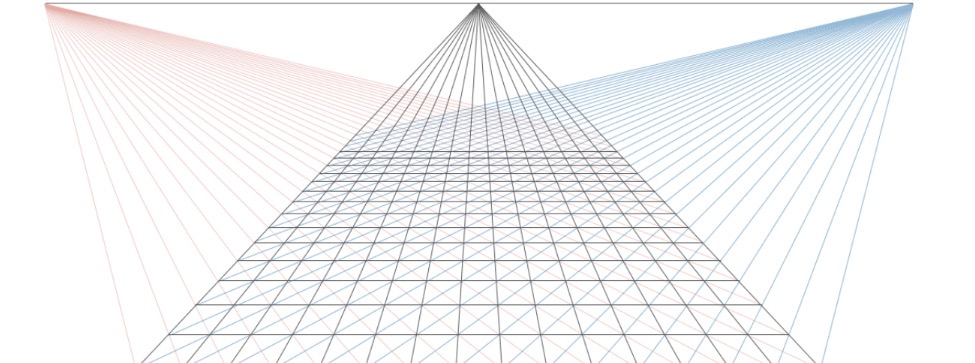

# 1. Хомогенни координати в равнината

---

## 📌 Основна идея

Точките, правите и равнините, изучавани до този момент, ще наричаме крайни.  
В двумерната евклидова равнина въвеждаме релация **"~"** (която лесно се установява, че е релация на еквивалентност), която дефинира структурата на хомогенните координати:

  

## 🔄 Какво представляват хомогенните координати в равнината?

Нека относно АКС в равнината е дадена крайна точка ). Ясно е, че наредената двойка ) е еднозначно определена. Дефинираме хомогенни координати на точка като %2C%20t%5Cneq0), за която е в сила:

  

Тогава за хомогенните координати на произволна точка можем да запишем:

  

### 🧪 Пример:

  

## 💡 Tip

> Ако видите точка от вида  
> )  
> пишете я  
> )  
> за по-малко сметки.

# 2. Безкрайни елементи в равнината

---

## 🔑 Най-важните неща

### 🌌 Безкрайна точка

Безкрайна точка на правата  наричаме множеството:

  

Всяка безкрайна точка (бележим ги с ) има вида ).

Очевидно безкрайната точка няма нехомогенни координати. Безкрайната точка е клас на еквивалентност, породен от релацията “направление”.

### 📏 Безкрайна права

Безкрайна права ще наричаме множеството от всички безкрайни точки:

  

### 📘 Твърдения

#### 📌 Твърдение 1

  

#### 📌 Твърдение 2

Две прави са обобщено успоредни тогава и само тогава, когато безкрайните им точки съвпадат.

#### 📌 Твърдение 3

Общото уравнение на права в равнината, в хомогенни координати, е:

  

и пишем:

  

#### 📌 Твърдение 4

Общото уравнение на безкрайната права  е:

  

---

## 💡 Tricks

> Ако в условието е казано "Правата g е успоредна на p и минава през точката M" използвайте, че p и q имат обща безкрайна точка U и разгледайте правата g като правата UM. Точката U намирате с помощтта на Твърдение 1 и Твърдение 4.

## 🧭 Визуална интуиция

   
  <em>Визуализация на общата безкрайна точка на успоредни помежду си прави</em>

---

   
  <em>Визуализация на безкрайната права</em>

# 3. Разширена евклидова равнина. Линейни трансформации на разширената евклидова равнина #

---

Дефинираме разширената евклидова равнина като множеството:

  

# 4. Хомогенни координати в пространството #
# 5. Безкрайни елементи в пространството #
# 6. Разширено евклидово пространство #
# 7. Централно проектиране #
# 8. Афинни и ортогонални трансформации в равнината #
# 9. Класификация на еднаквостите в равнината #
# 10. Афинни и ортогонални трансформации в пространството #
# 11. Класификация на еднаквостите в пространството #
# 12. Представяне на ротациите в пространството чрез кватерниони #
# 13. Сферична линейна интерполация (SLERP) #

Сферичната линейна интерполация (SLERP) е геодезична интерполация върху единичната n-сфера , използвана за плавни преходи между ориентации и посоки.

---

## Най-важното

- Интерполация по **най-късия път** върху сфера (геодезика)
- **Константна ъглова скорост**
- Запазване на **нормата**
- Числено стабилна при работа с **кватерниони**
- Фундаментална за **3D ротации и анимации**

---

## Дефиниции

### Векторна форма

  

  

където  , .

---

### Кватернионна форма

  

  

Еквивалентно:

  

---

## Най-важни твърдения

### 1. Запазване на нормата

  

---

### 2. Константна ъглова скорост

  

---

### 3. Геодезичност

SLERP параметризира дъга от голям кръг върху сферата.

---

### 4. Инвариантност спрямо ротации

  

---

### 5. Кватернионна групова структура

  

е относителната ротация, а степента \( t \) интерполира в групата.

---

### 6. Кратък път (sign correction)

  

гарантира минимална дъга.

---

### 7. Граничен случай

  

---

## Интуиция

- Векторно: движение по **сфера**
- Кватернионно: движение в **пространството на ротациите **
- Алгебрично: линейност в **ъгловото пространство**
- Геометрично: „дъга вместо хорда“

---

## Заключение

SLERP е каноничният начин за интерполация на ротации.  
Той съчетава геометрия, алгебра и числена стабилност в една формула, която следва естествената структура на пространството.