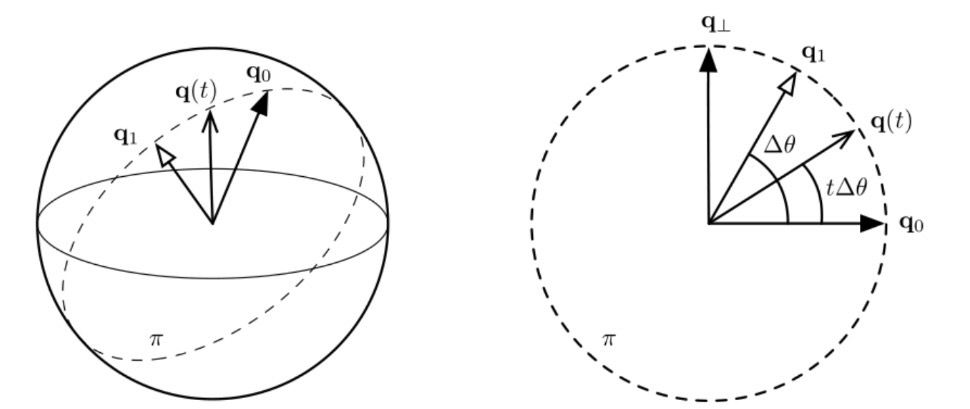

# 1. Хомогенни координати в равнината

---

### 📌 Основна идея

Точките, правите и равнините, изучавани до този момент, ще наричаме крайни.  
В $𝔼_2$ въвеждаме релацията $x \sim y \Leftrightarrow \exists \lambda \in ℝ \setminus \lbrace 0 \rbrace : x = \lambda y$ (която лесно се установява, че е релация на еквивалентност), която дефинира структурата на хомогенните координати:

### 🔄 Какво представляват хомогенните координати в равнината?

Нека относно АКС в $𝔼_2$ е дадена крайна точка $M(X,Y)$ е еднозначно определена. Дефинираме хомогенни координати на точка като всяка наредена тройка $(x,y,t)$, $t\neq 0$, за която е в сила:

$$
X=\frac{x}{t}\ \text{и}\ Y=\frac{y}{t}
$$

Тогава за хомогенните координати на произволна точка можем да запишем:

$$
(x,y,t) \sim (\rho x,\rho y,\rho t),\ \rho\neq 0
$$

#### 🧪 Пример:

$$
M(1,2,1) \sim M(-1,-2,-1) \sim M(2,4,6)
$$

#### 💡 Tip

> Ако видите точка от вида $(\rho x, \rho y, \rho t)$, пишете я $(x,y,t)$ за по-малко сметки.

# 2. Безкрайни елементи в равнината

---

### 🔑 Най-важните неща

#### 🌌 Безкрайна точка

Безкрайна точка на правата $\ell$ наричаме множеството:

$$
U_{\ell}=\lbrace \ell'|\ell'\parallel\ell \vee \ell'\sim\ell \rbrace
$$

Всяка безкрайна точка (бележим ги с $U_{\text{права}}$) има вида $U(a,b,0)$, където $(a,b)\neq (0,0)$.

Очевидно безкрайната точка няма нехомогенни координати. Безкрайната точка е клас на еквивалентност, породен от релацията “направление”.

#### 📏 Безкрайна права

Безкрайна права ще наричаме множеството от всички безкрайни точки:

$$
\omega = \lbrace (x,y,t) \in ℝ^3 \mid (x,y) \neq (0,0),\ t = 0 \rbrace
$$

### 📘 Твърдения

#### 📌 Твърдение 1

$$
U_\ell=\ell\cap\omega
$$

#### 📌 Твърдение 2

Две прави са обобщено успоредни тогава и само тогава, когато безкрайните им точки съвпадат.

#### 📌 Твърдение 3

Общото уравнение на права в равнината, в хомогенни координати, е:

$$
\ell:Ax+By+Ct=0,\ (A,B,C)\neq (0,0,0)
$$

и пишем $\ell[A,B,C]$.

#### 📌 Твърдение 4

Общото уравнение на безкрайната права $\omega$ е:

$$
\omega:t=0 \Rightarrow \omega[0,0,1]
$$

---

### 💡 Tricks

> Ако в условието е казано "Правата $g$ е успоредна на $p$ и минава през точката $M$" използвайте, че $p$ и $q$ имат обща безкрайна точка $U$ и разгледайте правата g като правата $UM$. Точката $U$ намирате с помощтта на Твърдение 1 и Твърдение 4.

### 🧭 Визуална интуиция

<p align="center">
  <br>
  <em>Визуализация на общата безкрайна точка на успоредни помежду си прави</em>
</p>

---

<p align="center">
  <br>
  <em>Визуализация на безкрайната права</em>
</p>

# 3. Разширена евклидова равнина. Линейни трансформации на $𝔼_2^\star$ #

Дефинираме разширената евклидова равнина като множеството:

$$
𝔼_2^\star:=𝔼_2\cup\omega
$$

В разширената евклидова равнина няма метрика, значи тя не е евклидово пространство. Нека $\varphi$ задава линейна трансформация на $𝔼_2^\star$ в хомогенни координати и нека $X(x,y,t)\xrightarrow{\varphi} X^\star(x^\star,y^\star,t^\star)$. Тогава 

```math
\varphi:\rho
\left(
\begin{matrix}
x^\star \\
y^\star \\
t^\star
\end{matrix}
\right)
=
A_{\varphi}
\left(
\begin{matrix}
x \\
y \\
t
\end{matrix}
\right),
\quad
\rho \neq 0,
```
където матрицата $A_{\varphi} = (a_{ij})_{i,j=1}^{3} \in M_3(ℝ)$ задава линейната трансформация $\varphi$.

Ако $\varphi \in \mathrm{GL}(𝔼_2^\star)$, т.е. $\varphi$ е обратима линейна трансформация на $𝔼_2^\star$, тогава $\varphi$ е биекция.

### Как действа $\varphi$ на правите и точките в разширената евклидова равнина? ###

### 🔑 Най-важните неща

> Действие върху точките:

```math
\varphi:\rho
\left(
\begin{matrix}
x^\star \\
y^\star \\
t^\star
\end{matrix}
\right)
=
A_{\varphi}
\left(
\begin{matrix}
x \\
y \\
t
\end{matrix}
\right),
\quad
\rho \neq 0\quad \text{и}\quad
\varphi^{-1}:\rho_0
\left(
\begin{matrix}
x \\
y \\
t
\end{matrix}
\right)
=
A_{\varphi}^{-1}
\left(
\begin{matrix}
x^\star \\
y^\star \\
t^\star
\end{matrix}
\right),
\quad
\rho_0 \neq 0
```

> Действие върху правите:

```math
\varphi:\sigma[A^\star\ B^\star\ C^\star]=[A\ B\ C]A_{\varphi}^{-1},
\quad
\sigma \neq 0\quad \text{и}\quad
\varphi^{-1}:\sigma_0[A\ B\ C]=[A^\star\ B^\star\ C^\star]A_{\varphi},
\quad
\sigma_0 \neq 0
```

# 4. Хомогенни координати в пространството #
# 5. Безкрайни елементи в пространството #
# 6. Разширено евклидово пространство #
# 7. Централно проектиране на $𝔼_3^\star$ #

### 📌 Основна идея

Нека спрямо координатна система в $𝔼_3^\star$ са дадени равнината $\pi$ и точката $S\not\in\pi$. Централно проектиране наричаме изображението 

$$
\Psi_{\pi}^S: 𝔼_3^\star \setminus \lbrace S \rbrace \to \pi,
$$

дефинирано посредством правилото: 

$$
\forall M \in 𝔼_3^\star \setminus \lbrace S \rbrace : \Psi_{\pi}^S(M)=SM\cap \pi
$$

Равнината $\pi$ наричаме проекционна равнина на $\Psi_{\pi}^S$, а точката $S$ наричаме проекционен център на $\Psi_{\pi}^S$.

### 📘 Твърдения

#### 📌 Твърдение 1

Централното проектиране не е обратима линейна трансформация

#### 📌 Твърдение 2

Безкрайната равнина $\Omega$ е инвариантна под действие на всяко успоредно проектиране на $𝔼_3^\star$ (и понеже успоредното проектиране не е обратима линейна трансформация, то значи не е афинна трансформация, независимо че изобразява безкрайните елементи в безкрайни елементи)

#### 📌 Твърдение 3 (Cheat формула)

Аналитичното представяне на централно проектиране с проекционен център $S(x_S,y_S,z_S,t_S)$ и проекционна равнина $\pi[A_\pi,B_\pi,C_\pi,D_\pi]$ е:

#### 📌 Твърдение 4


### ❗ Важно

Когато проекционният център на централното проектиране е безкрайна точка, т.е. $S\sim U$, то тогава  $\Psi_{\pi}^U$ наричаме успоредно (в часност ортогонално) проектиране на $𝔼_3^\star$

# 8. Афинни и ортогонални трансформации в равнината #
# 9. Класификация на еднаквостите в равнината #
# 10. Афинни и ортогонални трансформации в пространството #
# 11. Класификация на еднаквостите в пространството #
# 12. Представяне на ротациите в пространството чрез кватерниони #
# 13. Сферична линейна интерполация (SLERP) #

Сферичната линейна интерполация (SLERP) е геодезична интерполация върху единичната n-сфера , използвана за плавни преходи между ориентации и посоки.

---

## Най-важното

- Интерполация по **най-късия път** върху сфера (геодезика)
- **Константна ъглова скорост**
- Запазване на **нормата**
- Числено стабилна при работа с **кватерниони**
- Фундаментална за **3D ротации и анимации**

---

## Дефиниции

### Векторна форма

<p align="center">
  
</p>

където 

<p align="center">
  
</p>

---

### Кватернионна форма

Нека <span>
  
</span>. Тогава:

<p align="center">  </p>

Еквивалентно:

<p align="center">
  
</p>

<p align="center">
  <br>
  
---

## Най-важни твърдения

### 1. Запазване на нормата

<p align="center">
  
</p>

---

### 2. Константна ъглова скорост

<p align="center">
  
</p>

---

### 3. Геодезичност

SLERP параметризира дъга от голям кръг върху сферата.

---

### 4. Инвариантност спрямо ротации
Нека  и %20%3D%20%5Cmathrm%7BSLERP%7D(v_0%2C%20v_1%2C%20t)) е геодезичната дъга. Тогава за всяка ротация ) имаме, че ) е еквивариантна спрямо действието на групата.

<p align="center">
  
</p>

---

### 5. Кватернионна групова структура

<span>
  
</span> е относителната ротация, а степента t интерполира в групата.

---

### 6. Кратък път (sign correction)

<span>
  
</span> гарантира минимална дъга.

---

### 7. Граничен случай

<p align="center">
  
</p>

---

## Интуиция

- Векторно: движение по **сфера**
- Кватернионно: движение в **пространството на ротациите **
- Алгебрично: линейност в **ъгловото пространство**
- Геометрично: „дъга вместо хорда“

---

## Заключение

SLERP е каноничният начин за интерполация на ротации.  
Той съчетава геометрия, алгебра и числена стабилност в една формула, която следва естествената структура на пространството.
